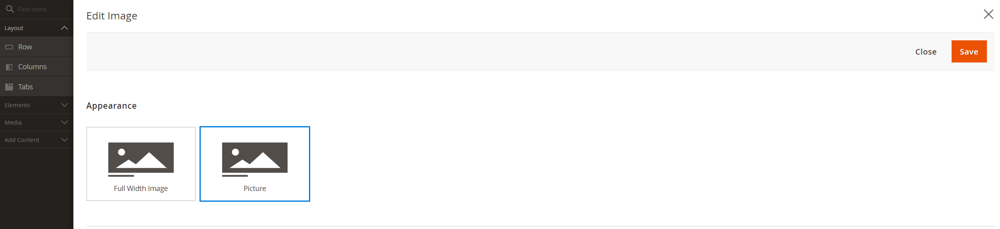

# Page Builder Advanced Image

---

## Image Appearances

Added Image appearance switcher with option to use &lt;picture&gt; instead of using default Magento approach with 2 images swithed by CSS class.

## Image Optimisation

### Image Loading

Both appearances contain "Lazy Load Image" switcher.
It will add to image on frontend attribute loading="lazy" if it's enabled, and loading="eager" if disabled.

### Image Size Attributes

Both appearances contain fields to setup image width and height, separately for mobile and desktop.
It is required to setup image size attributes to improve your site performance and get better mark on PageSpeed.

