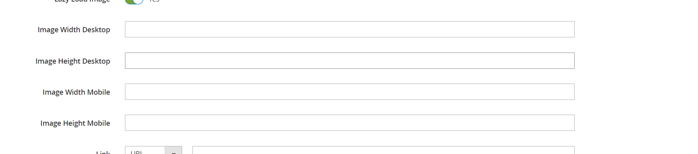

# Page Builder Advanced Image

---

## Image Optimisation

### Image Loading

Both appearances contain "Lazy Load Image" switcher.
It will add to image on frontend attribute loading="lazy" if it's enabled, and loading="eager" if disabled.


### Image Size Attributes

Both appearances contain fields to setup image width and height, separately for mobile and desktop.
It is required to setup image size attributes to improve your site performance and get better mark on PageSpeed.



## Installation
To install the module from Packagist, run the following commands:
```sh
composer require nortn/magento2-page-builder-advanced-image
bin/magento module:enable NortN_PageBuilderAdvancedImage
bin/magento setup:upgrade
bin/magento cache:flush
```

## Compatibility
- Magento 2.4.x
- Adobe Commerce (formerly Magento Commerce)

## Support
For any issues or feature requests, please open an issue on GitHub.

GitHub Repository: [m2ext-page-builder-advanced-image](https://github.com/norton-nimnul/m2ext-page-builder-advanced-image)
